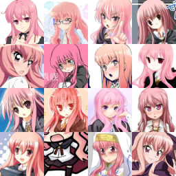

# Set-conditioned DC-GAN

This is an adaptation of the standard class-conditioned DC-GAN so now generator (and discriminator) are conditioned on an additional example set (as opposed to an explicit class label) whose distribution it must match.

For a similar idea, but in an autoencoder set-up, see [this paper](https://arxiv.org/abs/1606.02185).

## Acknowledgements

This repository is based off the popular [DCGAN-tensorflow](https://github.com/carpedm20/DCGAN-tensorflow) repo. Many thanks to Taehoon Kim / [@carpedm20](http://carpedm20.github.io/).

It also uses a GAN regulariser given [here](https://github.com/rothk/Stabilizing_GANs). Many thanks to the authors.

## Prerequisites

- Python 2.7 or Python 3.3+
- [Tensorflow 0.12.1](https://github.com/tensorflow/tensorflow/tree/r0.12) (Works with later versions)
- [SciPy](http://www.scipy.org/install.html)
- [pillow](https://github.com/python-pillow/Pillow)
- [matplotlib](https://matplotlib.org/) : Plotting tool for visualisation of synthetic shapes dataset
- (Optional) [Align&Cropped Images.zip](http://mmlab.ie.cuhk.edu.hk/projects/CelebA.html) : Large-scale CelebFaces Dataset

## Usage

Test on synthetic dataset:

    $ python main.py --dataset shapes --train
    
Or download dataset with:

    $ python download.py celebA

Train a model with downloaded dataset:

    $ python main.py --dataset celebA --use_tags --input_height=108 --train True

You can use your own dataset by:

    $ mkdir data/DATASET_NAME
    $ mkdir data/DATASET_NAME/CLASS_1
    ... add images to data/DATASET_NAME/CLASS_1 ...
    ... add images to data/DATASET_NAME/CLASS_2 ...
                       ...
    ... add images to data/DATASET_NAME/CLASS_N ...
    $ python main.py --dataset DATASET_NAME --train
    $ python main.py --dataset DATASET_NAME
    $ # example
    $ python main.py --dataset=eyes --input_fname_pattern="*_cropped.png" --train
    
Alternatively, for each image you can create a `[full_filename].tags` stored in the same directory as the image, consisting of a list of tags separated by spaces.

    $ python main.py --dataset=eyes --use_tags

## Results

### celebA
CelebA dataset using tags as classes

| Tag | Input example set | Generated samples |
| --- | --- | --- |
| 5_o_clock_shadow |  |  |
| bald |  |  |
| wearing_lipstick |  | |

### Anime faces
Dataset based on extracted faces from danbooru images using the 500 most popular character tags, roughly 400 images per character

| Tag | Input example set | Generated samples |
| --- | --- | --- |
| artoria_pendragon_(all) | _examples.png) | _samples.png) |
| louise_francoise_le_blanc_de_la_valliere |  |  |
| urakaze_(kantai_collection) | _examples.png) | _samples.png) |
